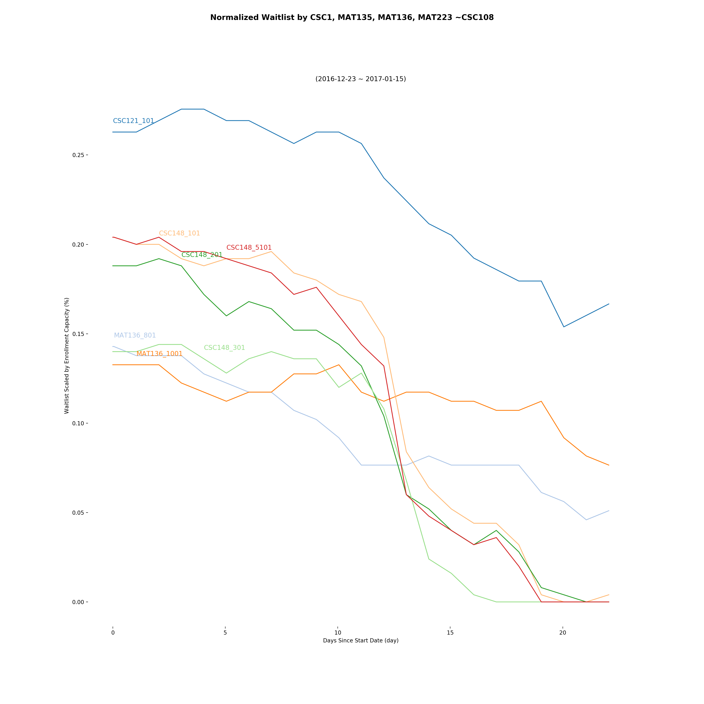
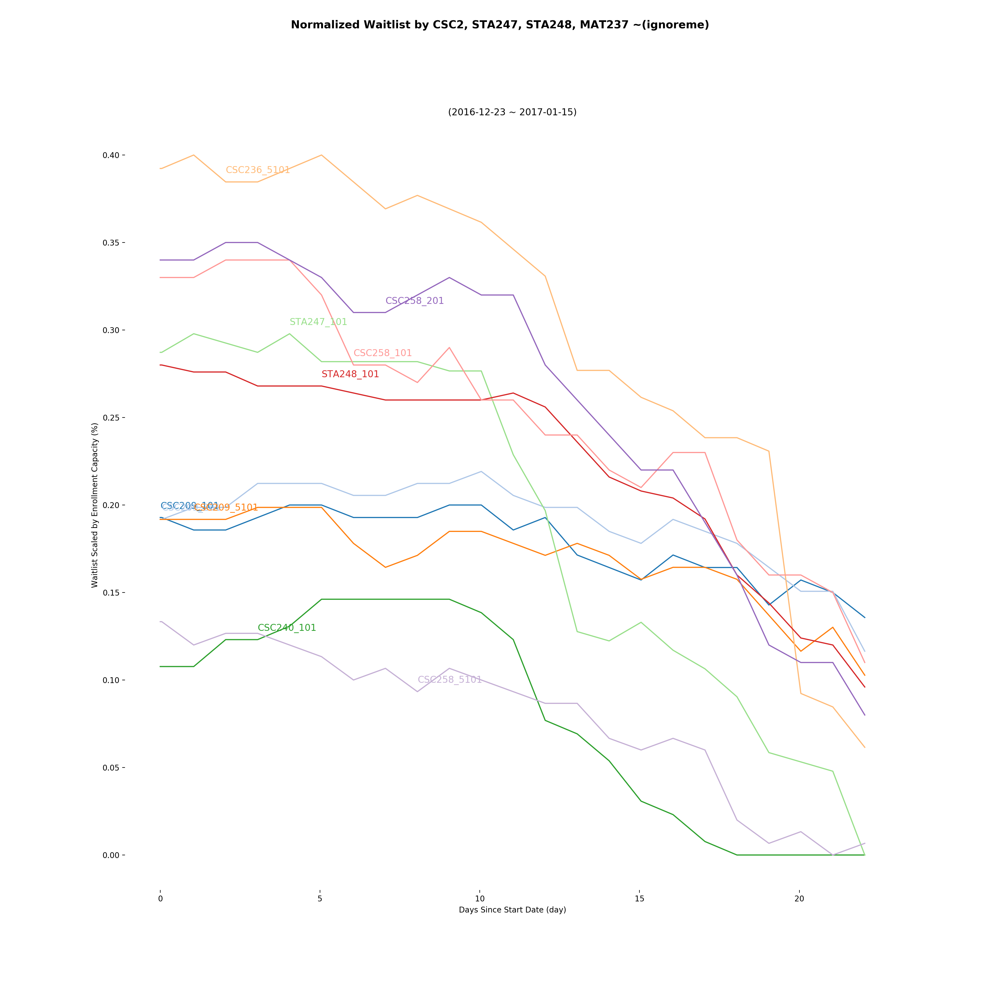
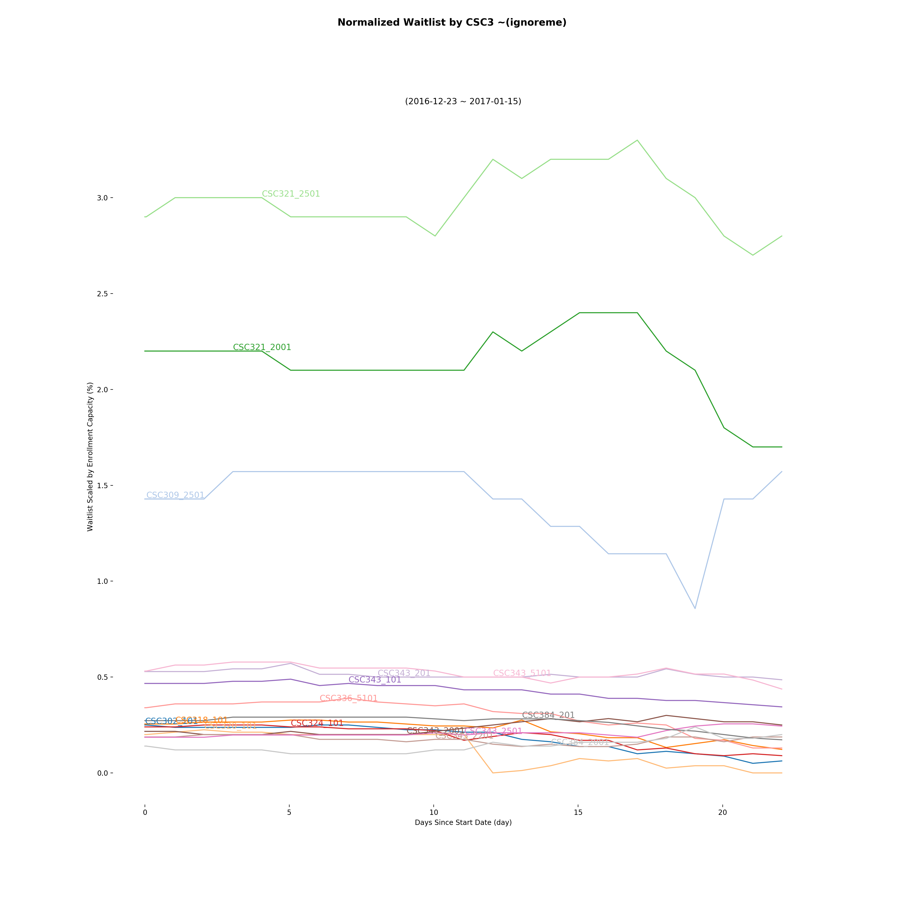
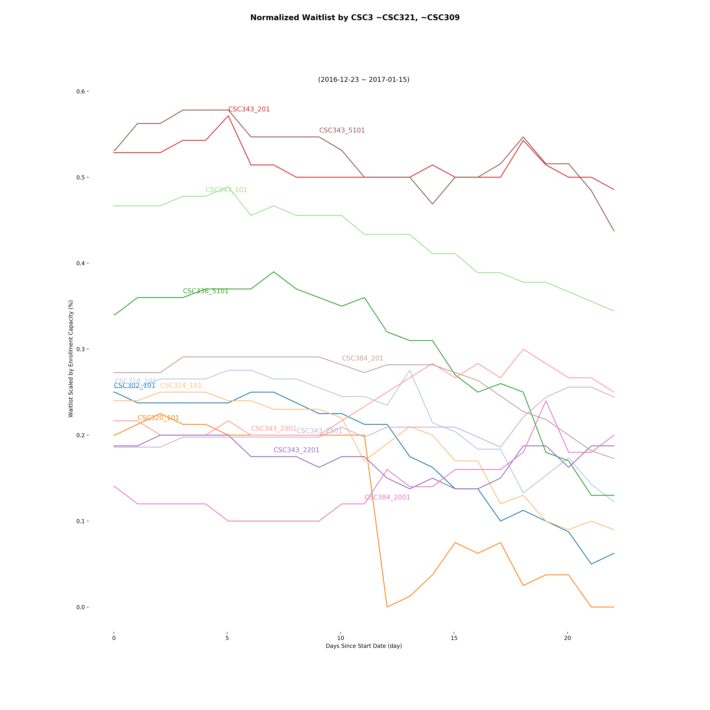

# Exploratory graphs 

Shown below are three graphs representing waitlist status from 2017 Winter enrollment at UofT. Data-set taken [uoft-timetable-archive](https://github.com/freeatnet/uoft-timetable-archive)







## Generate Graphs

1. Modify `BATCH_LINE_GRAPH` in `settings.py`
    + ex. ignore `CSC321` and `CSC309` as they are outliers
2. Run `python3 analysis.py` 




## Jupyter Notebook
```
# convert to .py
jupyter nbconvert {scraper,proc,analysis}.ipynb --to script
# execute from cli
jupyter nbconvert --to notebook --execute analysis.ipynb
```

