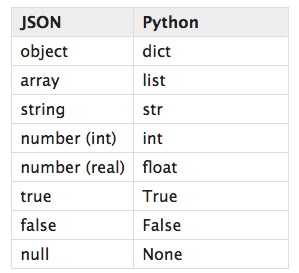

# Python Libs Notes

## `urllib`

`urllib.request`
+ sending request and return response
+ `urllib.request.urlopen(url, data=None, ...)`
  + `url`: either string or `Request`
  + returns a byte object or `http.client.HTTPResponse` (if url is HTTP) with
    + `geturl()`
    + `info()`: meta-info
    + `getcode()`
    + `msg`
+ `urllib.request.Request(url, data=None, headers={})`
  + abstraction of url request
  + `data`
    + if for HTTP POST, data in `application/x-www-form-urlencoded` format
    + `urllib.parse.urlencode()`: takes a mapping or sequence of 2-tuples and returns ASCII string in this format
  + `headers`
    + dictionary treated as if `add_header()` called with each key and value as arguments
    + keys
      + `User-Agent`: default `"Python-urllib/2.6"`
      + `Content-Type`: default `application/x-www-form-urlencoded`
+ `Request`Object interface
  + `full_url`
  + `host`
  + `data`
  + `method`
  + `add_header(key, val)`: HTTP only
  + `get_method()`: HTTP only

`urllib.parse`
+ url manipulation
+ `urllib.parse.urlparse(urlstring, scheme='', allow_fragments=True)`
  + parse a url and breaks down into six components
  + 
+ `urljoin(base, url)`
  + construct full uRL by combining `base` with `url`
+ `urlencode(query, ..)`
  + convert dict or sequence of tuples to a percent-encoded ASCII text string.
  + resulting string is a series of `key=value` pairs separated by `'&'` chars, and
    + space -> `+`
    + `/` -> `%2F`
  +

`urllib.error`
+ exception classes raised by `urllib.request`
  + `urllib.error.URLError` subclass of `OSError`
     + `reason`
   + `urllib.error.HTTPError` subclass of `URLError`
    + `code`
    + `reason`

## `re`
+ regular expression matching
+ methods
  + `re.compile(pattern)`
    + compile regular expression to object for use in `match()` and `search()`
    + `regex.search(string[, pos[, endpos]])`
    + `regex.match(string[, pos[, endpos]])`
  + `re.search(pattern, string)`
    + scan through string and look for first location where `pattern` produces a match, and return the `match object` otherwise `None`
  + `re.match(pattern, string)`
    + If zero or more chars at _beginning_ of `string` match regex `pattern` return corresponding `match object`, otherwise `None`
+ objects
  + `regex`
  + `match`
    + `if match` evaluates if match

## data structure

`list`
+ `append(x)`
+ `extend(iterable)`
+ `insert(i, x)`
+ `remove(x)`
+ `pop()`
+ `clear()`
+ `count(x)`
+ `sort()`
+ `reverse()`
+ `copy()`: shallow copy

``

## I/O
+ `open(file, mode='r', ...)`
  + open file and return _file object_
  + `file`:
    + path-like object
    + `str` or `bytes` or `fd`
  + `mode`:
    + `r`: read
    + `w`: write, truncate file if already exists
    + `x`: exclusive creation, fails if file already exists
    + `a`: append
    + `b`: binary
  + _file object_
    + `f.read(size)`: return empty string `''` on EOF
    + `f.readline()`: return empty string `''` on EOF
    + `f.write()`: return number of chars written
+ `json.dump(x, f)`
  + serializes object `x` to text files `f`
+ `json.load(f)`
  + decode object from `f`
+ read more on `json` and `pickle` modules

## JSON
+ `json.dump(obj, fp, ...)`
  + serialize `obj` as JSON stream to `fp` (note always produce `str` not `bytes` object), where `fp` supports `.write()`
+ `json.dumps(obj, ...)`
  + serialize `obj` to JSON formatted `str`
  + string version of `dump`
+ `json.load(fp, ...)`
  + deserialize `fp` (`.read()` supporting )
+ `json.loads(s, ...)`
  + string version of `json.load()`
+ _encoder and decoder_
  + `json.JSONDecoder`
    + conversion table by default
    + 

## OS

+ `os.listdir(path)`
  + excludes `.` or `..` entries

---
